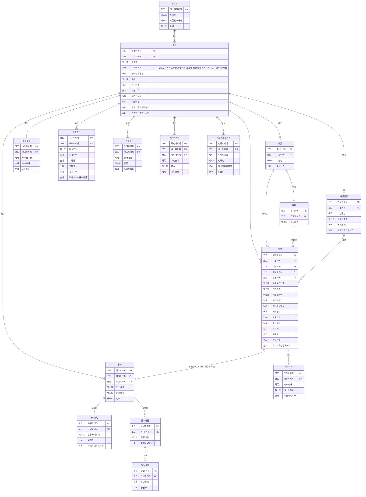
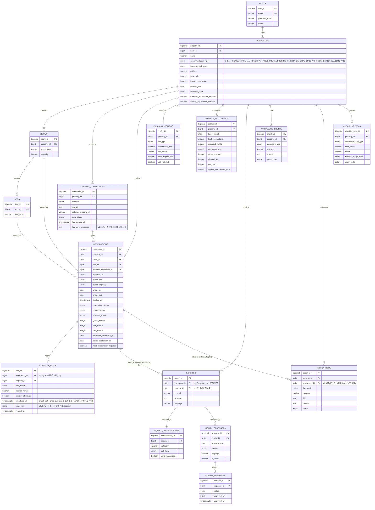
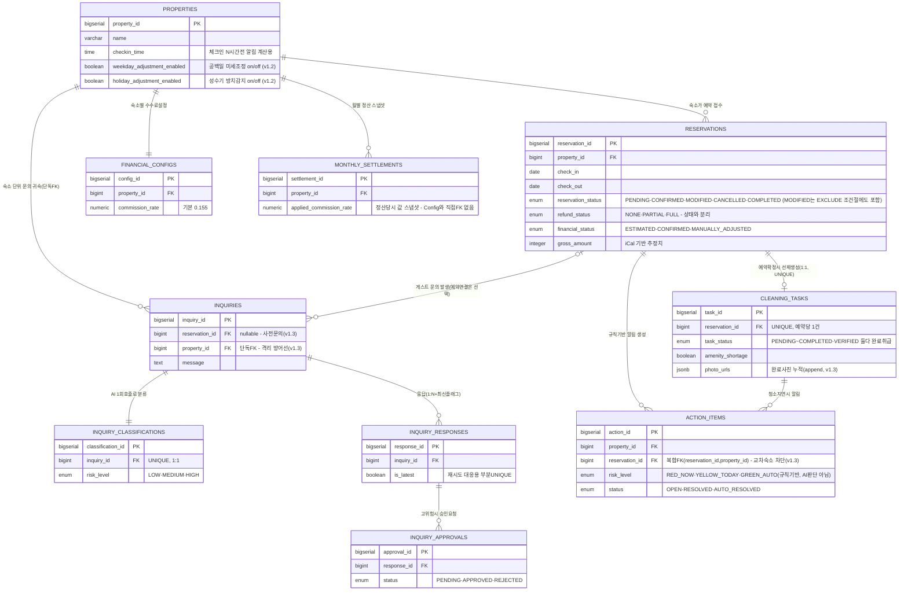

# Host ON (AI) — ERD (v1.3 최신 반영)

> DB 명세서(`3rd_host_ai_db_spec_v1.md`) 변경 시 이 파일도 함께 갱신할 것.
> 마지막 동기화: **v1.3** (9/4 1단계 검증 반영 — INQUIRIES nullable+단독FK,
> last_error_message / photo_urls 신규 컬럼, ACTION_ITEMS 복합FK)
>
> ⚠️ **2절(물리적 스키마)은 요약본이 아니라 DDL 전수 반영본이다.** 9/4 검증에서
> 컬럼 25개가 누락돼 있던 것을 보충했으므로, 앞으로 명세서에 컬럼을 추가할 때
> 여기도 반드시 같이 추가한다(빠뜨리면 다음 검증에서 또 걸린다).
> 단, `created_at`은 전 테이블 공통이라 ERD에서는 생략한다.
>
> Notion에 붙여넣을 때는 각 코드블록에서 ```mermaid 와 ``` 줄은 빼고
> erDiagram 부터 시작하는 내용만 넣을 것.

---

## 1. 논리적 스키마 (한글)



---

## 2. 물리적 스키마 (영문, 실제 DDL 기준)



---

## 3. RESERVATIONS 중심 확대본 (예약↔청소↔문의↔정산)


