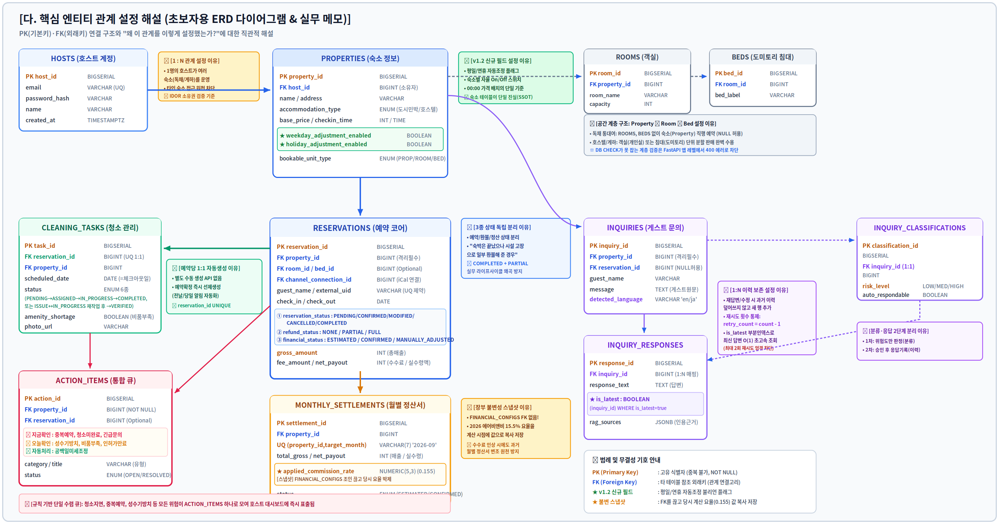

# Host ON (AI) — 핵심 엔티티 관계 설정 해설 (초보자용 ERD 메모)

> PK(기본키)·FK(외래키) 연결 구조와 "왜 이 관계를 이렇게 설정했는가?"에
> 대한 실무적 이유를 포스트잇 메모 형태로 설명한 시각적 ERD입니다.
> 비개발자도 직관적으로 이해할 수 있도록 만들었습니다.
>
> DB 구조가 바뀌면 이 파일도 `docs/3rd_host_ai_db_spec_v1.md` →
> `docs/erd.md` → **`docs/erd_memo.md`(이 파일)** 순서로 함께 갱신할 것.

## 이 다이어그램에서 특히 주목할 부분

- **PROPERTIES의 v1.2 신규 필드**(`weekday_adjustment_enabled`,
  `holiday_adjustment_enabled`) — 공백일 자동조정 기능의 on/off
  스위치이자 단일 진실공급원(SSOT)
- **accommodation_type ENUM 6종**(`URBAN_HOMESTAY`, `RURAL_HOMESTAY`,
  `HANOK`, `HOSTEL`, `LODGING_FACILITY`, `GENERAL_LODGING`) —
  관광진흥법 시행령 제2조 제1항 제3호 바목상 한 공간에 복수 유형
  등록이 불가능해 단일 ENUM으로 확정
- **RESERVATIONS의 3종 상태 완전 분리**(`reservation_status` /
  `refund_status` / `financial_status`) — "투숙완료+부분환불" 같은
  실무 조합을 표현하기 위한 설계
- **CLEANING_TASKS의 예약당 1:1 자동생성** — 예약 확정 즉시 선제
  생성되어 전날·당일 알림이 가능해짐(9/3 크로스체크로 시점 정정됨)
- **MONTHLY_SETTLEMENTS의 불변 스냅샷** — `FINANCIAL_CONFIGS`와 FK를
  의도적으로 끊고 계산 시점 요율을 값으로 복사 저장
- **INQUIRY_CLASSIFICATIONS ↔ INQUIRY_RESPONSES 2단계 분리** — 문의를
  먼저 분류(위험도 판정)하고, 승인 후 응답 이력을 별도로 남기는 구조
- **ACTION_ITEMS 단일 수렴 큐** — 청소지연·중복예약·성수기방치 등
  모든 위험 신호가 규칙 기반으로 이 테이블 하나로 모임
