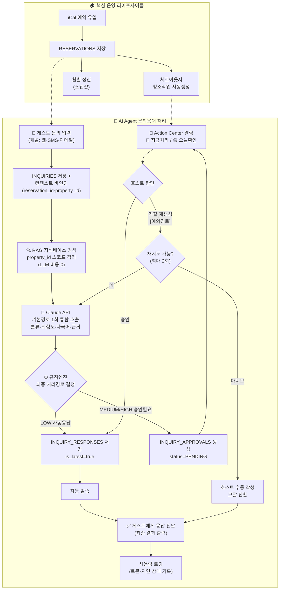

# Host ON (AI) — 구조 플로우차트

> DB 명세서 변경 시(특히 AI 응대 관련 로직) 이 파일도 함께 갱신할 것.
> GitHub에서 이 파일을 열면 아래 다이어그램이 자동으로 렌더링되어 보입니다.

```mermaid
flowchart TD
  subgraph LIFECYCLE["🏠 핵심 운영 라이프사이클"]
    direction LR
    R1["iCal 예약 유입"] --> R2["RESERVATIONS 저장"]
    R2 --> R3["체크아웃시<br/>청소작업 자동생성"]
    R2 --> R4["월별 정산<br/>(스냅샷)"]
  end

  subgraph AGENT["🤖 AI Agent 문의응대 처리"]
    direction TD
    A["👤 게스트 문의 입력<br/>(채널: 웹·SMS·이메일)"] --> B["INQUIRIES 저장 +<br/>컨텍스트 바인딩<br/>(reservation_id·property_id)"]
    B --> C["🔍 RAG 지식베이스 검색<br/>property_id 스코프 격리<br/>(LLM 비용 0)"]
    C --> D["🧠 Claude API<br/>기본경로 1회 통합 호출<br/>분류·위험도·다국어·근거"]
    D --> E{"⚙️ 규칙엔진<br/>최종 처리경로 결정"}
    E -->|"LOW 자동응답"| F["INQUIRY_RESPONSES 저장<br/>is_latest=true"]
    F --> G["자동 발송"]
    E -->|"MEDIUM/HIGH 승인필요"| I["INQUIRY_APPROVALS 생성<br/>status=PENDING"]
    I --> J["🔔 Action Center 알림<br/>🔴 지금처리 / 🟡 오늘확인"]
    J --> K{"호스트 판단"}
    K -->|"승인"| F
    K -->|"거절·재생성<br/>[예외경로]"| M{"재시도 가능?<br/>(최대 2회)"}
    M -->|"예"| D
    M -->|"아니오"| N["호스트 수동 작성<br/>모달 전환"]
    G --> H["✅ 게스트에게 응답 전달<br/>(최종 결과 출력)"]
    N --> H
    H --> L["사용량 로깅<br/>(토큰·지연·상태 기록)"]
  end

  R2 -.-> A
  R3 -.-> J
```
