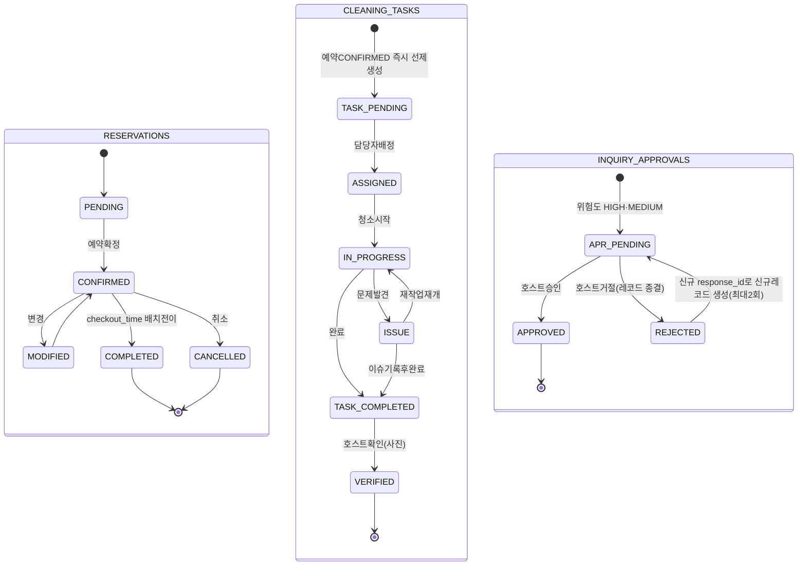
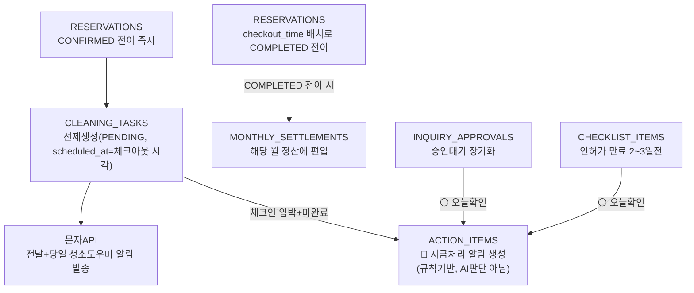

# Host ON (AI) — 상태전이 / 이벤트 구조 (재정정 최종본)

> DB 명세서(RESERVATIONS/CLEANING_TASKS/INQUIRY_APPROVALS ENUM) 변경 시
> 이 파일도 함께 갱신할 것.
>
> **🔴 9/3 재정정**: 청소작업 **생성 시점**을 "체크아웃 시점"에서
> **"예약 CONFIRMED 즉시(scheduled_at=체크아웃 시각으로 미리 세팅)"**로
> 변경. 이유: 이미 확정된 "청소 전날·당일 자동알림" 기능이, 체크아웃
> 당일에야 레코드가 생기면 "전날" 알림을 보낼 대상 자체가 없어 논리적
>으로 성립 불가능했음(당근마켓 청소인력 노쇼 방지가 원래 목적이었는데
> 정반대 결과). **청소가 실제로 시작되는 시점은 여전히 체크아웃
> 당일** — 생성과 실행 시점을 분리한 것.
>
> 크로스체크 반영사항:
> 1. CLEANING_TASKS의 ISSUE 상태에 복귀경로(IN_PROGRESS/COMPLETED) 추가
> 2. "체크아웃 이벤트"를 checkout_time 기준 배치 스케줄러로 명확화
> 3. INQUIRY_APPROVALS 거절 시 기존 레코드는 종결, 재생성은 새
>    response_id 기준 신규 레코드로 생성됨을 명시
> 4. **청소작업 생성 시점을 예약확정 즉시로 정정(위 참고)**

---

## 1. 핵심 엔티티 상태전이 (3개 병렬)



> 참고: `refund_status`(NONE→PARTIAL→FULL), `financial_status`
> (ESTIMATED→CONFIRMED/MANUALLY_ADJUSTED)는 `reservation_status`와
> 별도로 독립 전이(상태 분리 원칙, 명세서 v1.2 2.6절).

### 1-1. 청소작업 생성 시점 vs 실행 시점 (구현 시 반드시 참고)

```
[생성] 예약이 reservation_status=CONFIRMED으로 전이되는 즉시
  → CLEANING_TASKS 1건 선제 생성 (status=PENDING,
    scheduled_at = 해당 예약의 check_out(DATE)
                   + 해당 숙소의 checkout_time(TIME)
                   = 실제 체크아웃 시각, 예: 2026-09-12 11:00+09)
  → 이 시점부터 "전날/당일 자동알림" 스케줄링이 가능해짐
    (알림 시각은 scheduled_at에서 역산하므로 날짜만으로는 부족)

[실행] checkout_time 배치 스케줄러 (매시간 또는 최소 11:00 1회)
  → CONFIRMED 상태이면서 check_out+checkout_time이 현재시각을
    지난 예약을 조회
  → reservation_status를 COMPLETED로 전이
  → 같은 예약이 해당 월 MONTHLY_SETTLEMENTS 집계 대상으로 편입
  → (청소작업 자체는 이미 생성되어 있으므로 별도 생성 불필요,
    이 시점부터 청소도우미가 ASSIGNED→IN_PROGRESS로 실제 작업 시작)
```

> iCal에는 게스트의 실제 물리적 퇴실을 알려주는 웹훅이 없으므로,
> "체크아웃"은 항상 위 배치 스케줄러 기준으로 결정론적으로 판단한다.

### 1-2. INQUIRY_APPROVALS 거절→재생성의 실제 DB 동작

다이어그램의 `REJECTED → APR_PENDING`은 **같은 레코드를 되돌리는 게
아니다.** 실제로는:
1. 호스트 거절 시 기존 레코드는 `status='REJECTED'`로 **영구 종결**(이력 보존)
2. 재생성된 새 응답(`INQUIRY_RESPONSES`, 새 `response_id`)에 대해
   **새로운 `INQUIRY_APPROVALS` 레코드**가 `status='PENDING'`으로 생성됨

---

## 2. 이벤트 연결 구조 (예약 → 청소 → 정산 → 알림)



**핵심 원칙**: `ACTION_ITEMS`는 3개의 서로 다른 소스(청소지연, 승인대기
장기화, 컴플라이언스 만료)를 전부 규칙기반으로 수집하는 단일 지점이다.
새로운 알림 유형이 추가되어도 항상 이 구조(소스 → ACTION_ITEMS →
Action Center 화면)를 따른다.
