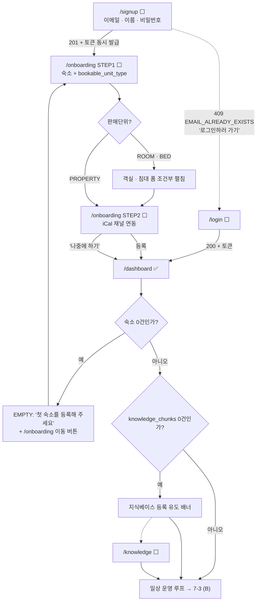
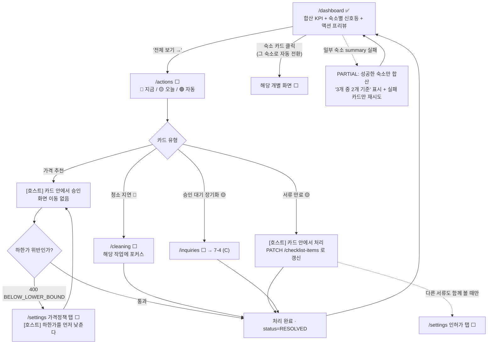
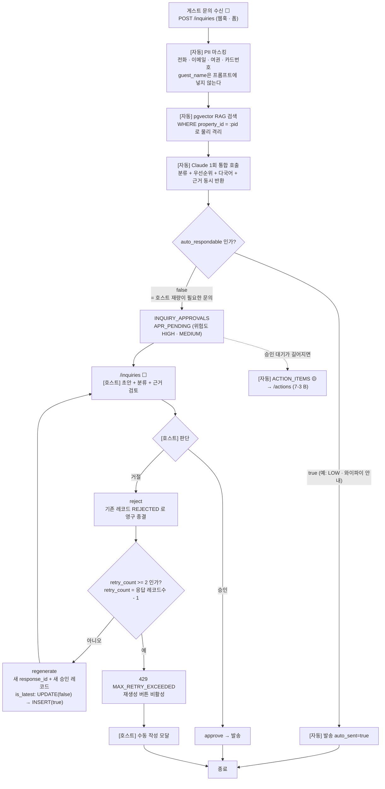
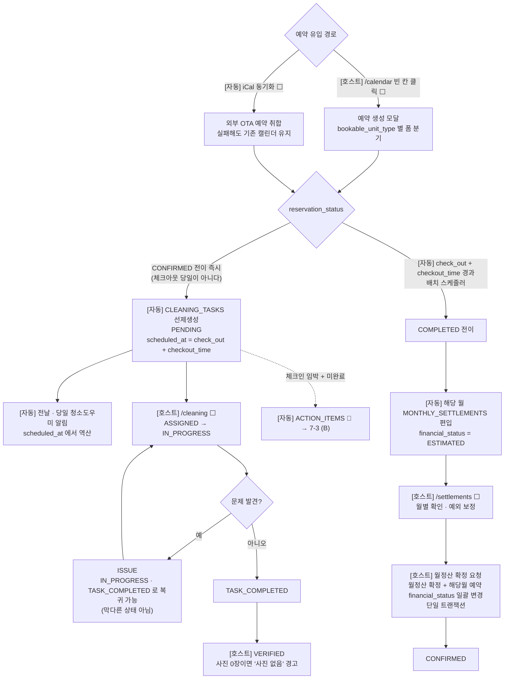
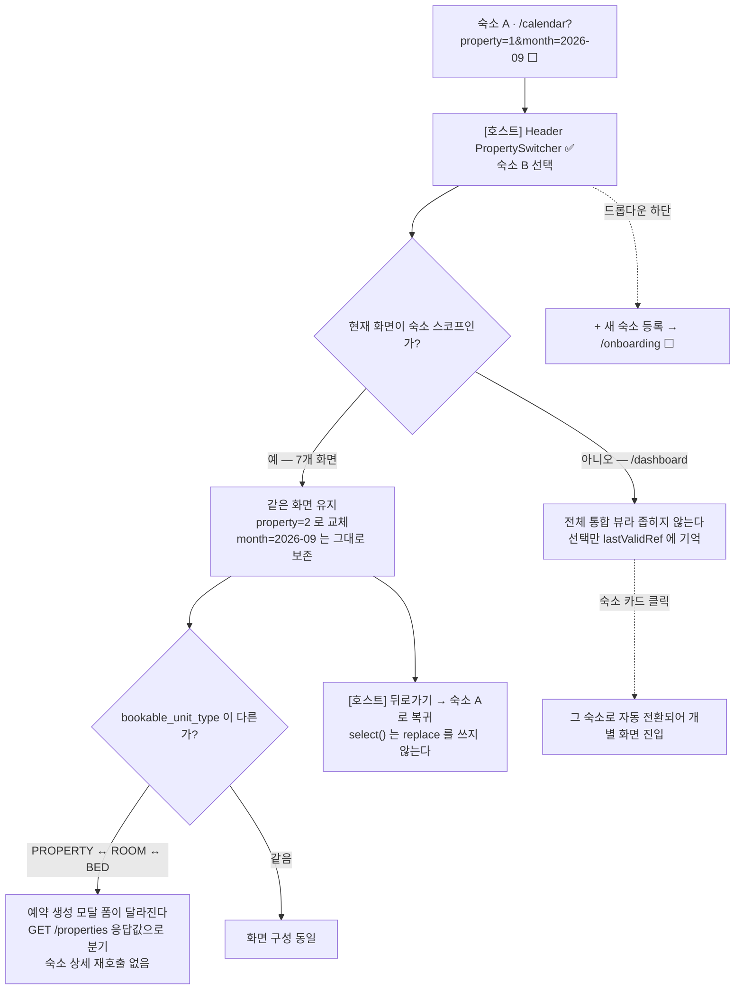

# Host ON (AI) — UI/UX 설계 (화면 목록 · 공통 컴포넌트)

## 0. 문서 성격

- **9/7 확정.** 화면 목록과 공통 컴포넌트의 SSOT다.
- 근거가 되는 API 스펙은 `docs/api_contract.md` **v2.3**.
- **9/8 개정**: `/compliance` 전용 화면을 `/settings` 4번째 탭으로
  흡수했다(라우트 12개 → **11개**, 사이드바 메뉴 9개 → **8개**).
  기능·데이터·API는 그대로이며 조회 위치만 바뀌었다.
- **9/9 개정**: 인증 토큰 저장 위치 확정(1-5절), 로그아웃 진입점
  확정(5-1절), `/login`·`/signup` 화면 상태·실패 처리 구체화(4-1·4-2절).
  `/signup`에 **이름 입력란 추가**(`HOSTS.name`이 `NOT NULL`).
- **9/9 추가**: **7절 User Flow — 전체 여정 5종**(신규 가입 / 일상 운영
  루프 / 문의 응대 / 예약→정산 / 멀티호스트 전환). 기존 7절(채택하지
  않은 설계와 근거)은 **8절**로 이동했다.
- **9/9 반영 (1.5단계 검증 판정 6건)**: 401 처리 정책(**1-6**),
  "오늘"의 기준(**1-7**), `/login` `?redirect` 처리(**4-1**),
  월 정산 확정 단방향 + 확인 모달(**4-9**), 상태 어휘 두 벌 구분
  (**5-9**), 딥링크(포커스) 파라미터 규격(**6-4**, 7-8이 참조).
- 이 문서는 체크리스트 9/7 태스크 **R33(전체 화면목록 확정)**과
  **R36(디자인시스템 공통 컴포넌트 정의)**의 산출물이다.
- **와이어프레임(R35)은 이 문서에 포함하지 않는다.** 화면 목록을
  크로스체크로 검증한 뒤 별도로 추가한다.
  → 핵심 화면 5종의 레이아웃은 `docs/ui_wireframe.md` 참고(9/7 작성).

---

## 1. UI/UX 설계 원칙 (9/7)

### 1-1. 이 원칙의 근거

아래 원칙은 대부분 **우리 프로젝트의 API 구조와 실사용 판단**에서
나온 것이다. 9/7에 Hostaway·Guesty·Lodgify·ONDA를 조사했으나
공식 문서로 확인된 것은 아래 한 가지뿐이며 나머지는 해석이었다.
설계 근거를 "업계 표준"으로 서술하지 않는다.

**공식 문서로 확인된 것 (1건)**
- 예약 이벤트 기반 자동 청소 태스크 생성: Hostaway·Guesty·Lodgify
  3사 공식 문서에서 확인. 단 트리거 시점은 체크인/체크아웃 기준이며
  우리는 예약 확정 시점으로 더 이르다(의도된 차이)

**조사했으나 확인하지 못한 것 (2건)**
- 서로 다른 숙박업 유형을 한 계정에서 통합 관리하는 사례
- 숙박업 인허가·서류 만료를 관리하는 기능
  → 둘 다 "없다"가 아니라 "공개 자료로 확인 불가"다.
    발표·문서에서 이 표현을 지킨다

**조사 과정에서 사실이 아님이 확인된 것**
- "채널별 예약 블록 색상(에어비앤비 초록 / 부킹닷컴 파랑 등)"은
  사실이 아니다. Hostaway 공식 지원문서의 색상 체계는 채널이 아니라
  예약 상태 기준이다. 3회의 독립 검증에서 일치. 이 주장을 근거로
  쓰지 않는다.

**출처가 아니라 가설로 취급하는 것**
- "통합 뷰가 업계 기본값이다", "조회와 처리를 분리하는 것이 업계
  원칙이다", "경쟁 제품은 동선이 길어 피로하다" — 이 셋은 제품
  문서에서 확인된 사실이 아니라 화면을 보고 도출한 해석이다.
  우리 판단의 참고로만 쓰고, "경쟁사가 그렇게 한다"고 서술하지
  않는다.

**인용하지 않는 것**
- 경쟁 제품의 타깃 규모 숫자(5~100개, 2~20개 등)는 어느 것도 공식
  표기와 일치하지 않았다. 문서·발표에서 인용하지 않는다.
- ONDA는 비교 근거에서 제외한다. 유형 혼합 관리와 인허가 관리
  기능 두 항목이 우리 차별점과 정확히 겹치는데 둘 다 공개 자료로
  확인 불가이므로, 확인되지 않은 것을 "우리만 한다"의 근거로 쓸
  수 없다.

### 1-2. 설계 원칙 (우리 판단)

**1. 전체 통합이 기본, 개별 전환은 도구**
근거: property_id 스코프 엔드포인트가 13종. 숙소를 하나씩 골라야
조회되는 구조라 3~5개 운영 시 아침마다 5번 전환해야 한다.
대시보드는 전체 통합, PropertySwitcher는 개별 화면 전환용.

**2. 조회와 처리를 분리**
근거: 액션 카드는 운영이 쌓일수록 누적된다. 대시보드에 전부 담으면
스크롤 지옥, 상위 N건만 담으면 나머지를 볼 곳이 없다.
대시보드는 요약 + 상위 프리뷰, /actions는 전체 큐와 처리 이력.

**3. 사이드바에 계층을 만들지 않는다**
근거: 사이드바 메뉴(운영 화면 8개)는 한 화면에 들어간다. 모드·그룹으로
묶으면 클릭이 늘고 위치를 외워야 한다.
※ 이 원칙은 사이드바 네비게이션에 적용되며, 화면 내부의 탭
  구조(예: /settings 4탭)는 대상이 아니다.

**4. 위젯 구성은 고정**
근거: 커스터마이즈는 설정 화면과 저장 구조를 추가로 요구한다.
1인 개발 일정에서 우선순위가 아니다.

**5. 저해상도 와이어프레임**
근거: 이 단계의 목표는 "화면이 몇 개고 무엇이 들어가는가"다.
색·폰트·간격은 프론트 구현 시점에 정한다.
※ 이 원칙은 와이어프레임을 **어떻게 그릴지**에 대한 것이다.
  와이어프레임 자체(R35)를 이 문서에 포함할지 여부는 0절 참고.

### 1-3. 새 화면·기능 판단 기준

**"3~5개 숙소를 혼자 운영하는 호스트가 아침에 이걸 쓰는가?"**

아니면 넣지 않는다. 특히 아래는 이번 범위에서 제외한다.
- 고급 분석·커스텀 리포트
- 팀원 배정·권한 관리
- 오너 포털

**화면을 추가하기 전에 기존 화면이 그 일을 이미 하는지 확인한다.**
액션센터가 알림 발생부터 처리까지 완결하는 도메인은 전용 화면이
필요하지 않을 수 있다. (9/8 `/compliance` 사례 — 아래 4-11절)

### 1-4. 캘린더 표시 방식

PROPERTY 단위 숙소는 한 줄, ROOM/BED 단위 숙소는 접기/펼치기로
하위 단위를 별도 행에 표시한다.
근거: 하나의 예약 테이블로 세 판매 단위를 표현하는 우리 구조를
한 화면에 담는 방법. 유사 화면을 쓰는 제품이 있으나 공식 문서로
확인된 것은 "서브유닛 개별 행 표시"까지이며 접기/펼치기는 확인하지
못했다. 이 선택은 우리 판단이다.

**예약 블록 색상은 예약 상태 기준으로 구분한다.** 채널별 색상은
쓰지 않는다.
- 색상 대상 필드: reservation_status / refund_status /
  financial_status, 그리고 파생 필드 is_conflict
- **구체적인 색상 값은 여기서 정하지 않는다.** 원칙 5(저해상도)에
  따라 프론트 구현 시점에 정한다. 다만 is_conflict(더블부킹)는
  가장 강한 경고색을 쓴다 — 호스트에게 최악의 사고이며 대시보드
  conflict_count와 함께 즉시 인지되어야 한다.

### 1-5. 인증 토큰 저장 위치 (9/9 확정)

**JWT 토큰은 `localStorage`에 저장한다.** 키는 `hoston_access_token`이며,
접근은 `src/api/client.ts`의 `getAccessToken()`·`clearAccessToken()`
**두 함수를 통해서만** 한다. 저장 방식을 바꾸더라도 그 두 곳만 고치면 된다.

**채택하지 않은 것과 이유**

| 방식 | 배제 이유 |
|---|---|
| httpOnly 쿠키 | 프론트(Vercel)와 백엔드(Render)가 **서로 다른 도메인**이라 `SameSite=None` + `Secure` + CORS `credentials`가 **모두** 맞아야 한다. 하나라도 어긋나면 로그인 자체가 동작하지 않는다. D-32에 감당할 리스크가 아니다 |
| 메모리(변수·Context) | **새로고침하면 로그인이 풀린다.** 시연 중 F5 한 번에 로그인 화면으로 돌아간다 |

**XSS 대응** — `localStorage`는 스크립트가 읽을 수 있으므로 XSS가 곧 토큰
탈취다. 아래를 지킨다.

- React의 **기본 이스케이핑에 의존**한다
- **`dangerouslySetInnerHTML`을 사용하지 않는다**
- 외부 입력을 화면에 표시할 때 특히 주의한다 — **게스트 문의 본문
  (`INQUIRIES.message`)이 이 프로젝트의 유일한 외부 입력 표시 지점**이며
  `/inquiries` 화면이 그것을 그대로 렌더한다

> P1 확장 시 httpOnly 쿠키 + 리프레시 토큰 구조로 전환을 검토한다
> (`api_contract` 1.1절 — 지금은 리프레시 토큰을 두지 않는다).

### 1-6. 401 처리 정책 (9/9 확정 — 1.5단계 검증)

**401을 받으면 토큰을 지우고 `/login?redirect={현재 경로}`로 이동한다.**

| 항목 | 정책 |
|---|---|
| 토큰 | `clearAccessToken()`으로 **즉시 삭제** |
| 이동 | `/login?redirect={현재 경로}` — 쿼리를 포함한 전체 경로 |
| **작성 중이던 입력** | **보존하지 않는다.** 알림만 표시한다 |
| 비로그인 상태로 보호된 경로 직접 진입 | **같은 처리.** 라우트 가드가 같은 형태로 `/login`에 보낸다 |

**입력을 보존하지 않는 이유**: 보존하려면 화면마다 임시 저장소와 복원
시점을 따로 설계해야 하고, 복원 시점의 서버 상태가 이미 달라져 있을 수
있다(다른 기기에서 같은 예약을 수정했을 수 있다). **D-32 일정에서
"복원했는데 틀린 값이 들어가는" 위험이 입력을 다시 치는 비용보다 크다.**
대신 **왜 로그인 화면으로 왔는지를 반드시 알린다** — 아무 설명 없이
로그인 화면이 뜨면 앱이 고장난 것으로 보인다.

> **`/login` 화면 자체의 401은 이 정책의 예외다.** 로그인 실패
> (`INVALID_CREDENTIALS`)는 세션 만료가 아니라 자격증명 오류이므로
> 리다이렉트하지 않고 메시지만 표시한다(4-1절, CLAUDE.md 규칙 15).

> **401과 네트워크 오류를 구분한다.** 네트워크 오류(`error.response` 부재)
> 에서는 **토큰을 지우지 않는다.** Render 슬립·재시작이 잦아 구분하지
> 않으면 서버가 잠깐 불안정한 것만으로 로그아웃된다
> (`api_contract` 1.4절).

### 1-7. "오늘"의 기준 (9/9 확정 — 1.5단계 검증)

**"오늘"은 서버가 KST 기준으로 판정한다. 프론트는 브라우저 시각으로
오늘을 계산하지 않는다.**

| 항목 | 규칙 |
|---|---|
| 판정 주체 | **서버.** 프론트는 서버가 준 값을 그대로 쓴다 |
| 기준 시간대 | **KST(Asia/Seoul)** 고정 |
| 재조회 시점 | **탭 포커스 복귀 시 재조회한다** |

**이 기준을 쓰는 곳 3군데**

| 화면 | 무엇이 "오늘"에 의존하는가 |
|---|---|
| `/dashboard` | KPI — `today_checkin_count` · `today_checkout_count` · `today_turnover_count` (4-4절) |
| `/calendar` | 초기 표시 월·주의 위치 (4-5절) |
| `/cleaning` | `scheduled_at` 기준 정렬과 "오늘 할 청소" 판정 (4-8절) |

**브라우저 시각을 쓰지 않는 이유**: 호스트가 해외에서 접속하거나 PC
시계가 틀어져 있으면 **화면의 "오늘"과 서버 집계의 "오늘"이 갈라진다.**
KPI는 서버가 센 값인데 캘린더만 브라우저 기준으로 오늘을 표시하면, 같은
화면 안에서 두 개의 "오늘"이 생긴다.

**탭 포커스 복귀 시 재조회하는 이유**: 이 앱은 **하루 종일 켜두는
운영 도구**다(7-3 일상 운영 루프). 자정을 넘겨도 화면이 그대로면
어제의 "오늘"을 보게 된다. 포커스 복귀는 자정 타이머보다 단순하고,
Render 슬립 후 첫 상호작용 시점과도 겹쳐 웨이크업 효과가 있다.

> ⚠️ **미해소 — `api_contract` 쪽 확인 필요(이 문서 범위 밖)**
> `today_*` 집계는 `CURRENT_DATE`를 쓰는데(api_contract 4절),
> `CURRENT_DATE`는 **DB 세션의 시간대 설정을 따른다.** 로컬은
> `docker-compose.yml`이 `TZ: Asia/Seoul`을 주지만 **Supabase 기본값은
> UTC**다. 그대로 두면 **매일 KST 00:00~09:00 사이에 배포본만 하루
> 어긋난다.** 또 응답에 **기준일 필드가 없어** 프론트가 "며칠 기준"인지
> 표시할 수 없다. 처리 시점은 4절 이월(devlog 2026-09-09) 참고.

---

## 2. 라우트 11개

| # | 라우트 | 화면명 | 주요 API | 비고 |
|---|---|---|---|---|
| 1 | `/login` | 로그인 | `POST /auth/login` | JWT 발급 |
| 2 | `/signup` | 회원가입 | `POST /auth/signup` | |
| 3 | `/onboarding` | 온보딩 위저드 | `POST /properties`, `POST /properties/{id}/rooms`, `POST /rooms/{room_id}/beds`, `POST /properties/{id}/channels` | 단일 URL, 2스텝 (아래 상세) |
| 4 | `/dashboard` | 통합 대시보드 | `GET /properties` + `GET /properties/{id}/dashboard/summary` × N | 전체 숙소 통합 |
| 5 | `/calendar` | 캘린더 | `GET /properties/{id}/reservations`, `GET /reservations/{id}`, `POST /reservations`, `PATCH /reservations/{id}/status` | 예약 생성/상세는 **모달** |
| 6 | `/inquiries` | AI 게스트 인박스 | `GET /properties/{id}/inquiries`, `GET /inquiries/{id}`, `POST /inquiries/{id}/regenerate`, `POST /inquiry-approvals/{id}/approve`, `POST /inquiry-approvals/{id}/reject` | 재시도 최대 2회(총 3회) |
| 7 | `/actions` | 액션센터 | `GET /properties/{id}/action-items?status=OPEN`, `PATCH /action-items/{id}/resolve`, `GET /properties/{id}/price-recommendations`, `POST /properties/{id}/price-recommendations/apply` | 가격 추천 승인 포함 |
| 8 | `/cleaning` | 청소 관리 | `GET /properties/{id}/cleaning-tasks`, `PATCH /cleaning-tasks/{id}/status`, `POST /cleaning-tasks/{id}/photo` | |
| 9 | `/settlements` | 정산 리포트 | `GET /properties/{id}/settlements`, `POST /properties/{id}/settlements/{month}/confirm`, `GET·PATCH /properties/{id}/financial-config` | 스냅샷 정산 |
| 10 | `/knowledge` | RAG 지식베이스 | `GET·POST /properties/{id}/knowledge-chunks`, `DELETE /knowledge-chunks/{id}` | |
| 11 | `/settings` | 설정 (4탭) | `GET·PATCH /properties/{id}`, 채널 5종, `GET /properties/{id}/checklist-items`, `PATCH /checklist-items/{id}` | 아래 상세 |

> **`/compliance`(인허가 체크리스트)는 전용 라우트를 두지 않는다 —
> `/settings` 4번째 탭으로 흡수했다(9/8, 세 차례 독립 검토 일치).**
> **기능이 줄어든 것이 아니라 위치만 바뀐 것**이므로 3절 "제외한
> 화면"에 넣지 않는다. 데이터·API·만료 알림은 전부 그대로 남고,
> 상세는 아래 **4-11절 탭 4**에 있다.
>
> 근거 3가지:
> 1. **액션센터 안에서 이미 완결된다.** 만료 30일 전 배치가
>    `ACTION_ITEMS` 카드를 발행하고, 처리도 `PATCH
>    /checklist-items/{id}`로 카드에서 끝난다. 전용 화면이 추가로
>    하는 일은 **전체 목록 조회 하나뿐**이다.
> 2. **범위 대비 과하다.** CLAUDE.md는 컴플라이언스를 *"정적
>    체크리스트 템플릿 + 만료알림 수준"*으로 이미 제한한다. 그
>    범위에 사이드바 한 자리를 쓰는 것은 비용이 맞지 않는다.
> 3. **생성 경로 문제가 함께 풀린다.** `CHECKLIST_ITEMS`를 누가
>    만드는지가 미정이었는데(troubleshooting 22번), 설정 화면에서
>    호스트가 직접 추가하는 것은 어색하지 않다.

### 2-3. `/onboarding` — 단일 URL, 2스텝 위저드

**라우트를 `/step1`, `/step2`로 쪼개지 않는다.**

| 스텝 | 내용 |
|---|---|
| **STEP 1** | 숙소 등록 + 판매단위 설정. `bookable_unit_type`이 `PROPERTIES` 컬럼이므로 **같은 폼에서 함께 받는다.** `ROOM`/`BED` 선택 시에만 객실 입력 폼이 조건부로 펼쳐진다 |
| **STEP 2** | iCal 채널 연동. **"나중에 하기" 허용** |

**지식베이스는 온보딩에 포함하지 않는다.** 대시보드 배너로 유도한다.
> 근거: 게스트 문의를 받아보고 채우는 정보이며, 온보딩에서 긴 텍스트
> 입력을 강제하면 이탈 지점이 된다.

### 2-11. `/settings` — 4탭

| 탭 | 내용 | API |
|---|---|---|
| 탭 1 | 숙소정보 | `GET·PATCH /properties/{id}` |
| 탭 2 | 가격정책 | `PATCH /properties/{id}` — `base_price`, `lower_bound_price`, `weekday_adjustment_enabled`, `holiday_adjustment_enabled` |
| 탭 3 | 채널연동 | `GET·POST /properties/{id}/channels`, `DELETE /channels/{id}`, `POST /channels/{id}/sync`, `GET /channels/{id}/sync-errors` |
| 탭 4 | 인허가 | `GET /properties/{id}/checklist-items`, `PATCH /checklist-items/{id}` (9/8 흡수) |

**가격정책 탭이 필요한 근거**: api_contract 13절이 가격 추천 apply 시
하한가 위반을 `400 BELOW_LOWER_BOUND`로 거부하며 *"호스트가 하한가를
먼저 낮춰야 적용 가능"*이라고 명시한다. 즉 **하한가를 낮추는 화면이
반드시 필요하다.**

---

## 3. 제외한 화면과 근거

### `/checkin` (비대면 체크인) — **P1 확장 예정 화면**

- api_contract에 관련 엔드포인트 **0개**, DB명세서 16개 테이블에
  체크인 도메인 **없음**(9/7 확인).
- 체크리스트상 비대면 체크인은 **9/29~9/30 4단계 태스크**이므로,
  그 시점에 **데이터 설계부터** 진행한다.

### 가격 전용 화면 — 만들지 않는다

CLAUDE.md 원칙상 가격조정은 **전용 테이블 없이 `ACTION_ITEMS` 카드로만**
표현한다. 따라서 화면도 둘로 나눈다.

| 기능 | 화면 |
|---|---|
| 추천 승인 | `/actions` |
| 기준가·하한가 편집 | `/settings` 가격정책 탭 |

---

## 4. 화면별 주요 구성

> **4상태(LOADING / SUCCESS / EMPTY / ERROR)를 화면마다 정의한다.**
> 특히 **EMPTY가 핵심**이다 — 발표 시연에서 빈 화면이 나오면 안 되므로,
> 데이터 0건일 때의 안내 문구와 **다음 행동**을 반드시 적는다.

### 4-1. `/login`

- **목적**: 호스트 인증 후 JWT 발급
- **주요 API**: `POST /auth/login`
- **화면 요소**: 이메일 / 비밀번호 / 로그인 버튼 / 회원가입 링크

| 상태 | 표시 |
|---|---|
| 입력 대기 | 초기 상태. 버튼 활성 |
| 제출 중 | **버튼 비활성 + 스피너, 입력 비활성.** 중복 제출로 같은 요청이 두 번 나가지 않게 한다 |
| 실패 | 폼 하단 인라인 에러. 입력값은 **지우지 않는다**(이메일을 다시 치게 하지 않는다) |
| 성공 | 토큰 저장 후 **`?redirect` 값이 있으면 그 경로로, 없으면 `/dashboard`로** 이동 |

**`?redirect` 파라미터 처리 (9/9 확정 — 1.5단계 검증)**

세션이 만료돼 이 화면으로 밀려온 사용자는 **보던 화면으로 돌아가야
한다**(1-6절). `/login?redirect=/cleaning%3Fproperty%3D2%26task_id%3D42`
형태로 도착하며, 로그인 성공 시 그 경로로 이동한다.

| 상황 | 이동할 곳 |
|---|---|
| `?redirect` 있음 | **그 경로** — 쿼리(`?property=`·포커스 파라미터)까지 그대로 복원 |
| `?redirect` 없음 | `/dashboard` |
| `?redirect` 값이 **외부 URL이거나 `/`로 시작하지 않음** | **무시하고 `/dashboard`** |

> ⚠️ **오픈 리다이렉트를 막는다.** `?redirect=https://evil.example`를 그대로
> 따라가면 로그인 직후 외부 사이트로 보내는 피싱 경로가 된다.
> **`/`로 시작하는 앱 내부 경로만 허용**하고(`//`로 시작하는
> 프로토콜 상대 URL도 거부), 그 외에는 조용히 `/dashboard`로 보낸다.

> **로그인 화면에 도착한 이유를 표시한다.** 세션 만료로 밀려온 경우
> ("로그인이 만료되어 다시 로그인해 주세요")와 처음 방문한 경우를
> 구분하지 않으면, 사용자는 앱이 고장난 것으로 받아들인다.

**실패 메시지는 하나로 통일한다.**

> **"이메일 또는 비밀번호가 올바르지 않습니다"**

어느 쪽이 틀렸는지 알려주면 이메일만 바꿔가며 **가입된 계정을 열거**할 수
있다. 서버도 같은 이유로 `401 INVALID_CREDENTIALS` 하나만 반환한다
(`api_contract` 1.1절).

> **이 화면의 401은 리다이렉트하지 않는다.** `authApi`(401 인터셉터가 없는
> 별도 인스턴스)로 호출하고 호출부가 `try/catch`로 잡아 위 메시지만
> 표시한다. 공용 인스턴스를 쓰면 401 인터셉터가 토큰을 지우고 `/login`으로
> 보내, 로그인 화면에서 로그인 화면으로 튕기는 것처럼 보인다(9/8 확정).

### 4-2. `/signup`

- **목적**: 신규 호스트 계정 생성
- **주요 API**: `POST /auth/signup`
- **화면 요소**: 이메일 / **이름** / 비밀번호 / 비밀번호 확인 / 가입 버튼

> **이름 입력란이 필요하다.** `HOSTS.name`이 `VARCHAR(100) NOT NULL`이라
> (명세서 2.1절) 값을 받지 않으면 서버가 무엇을 채울지 정해야 한다.
> 9/9 대조에서 이 화면 요소에 이름이 빠져 있는 것을 발견해 추가했다.

| 상태 | 표시 |
|---|---|
| 입력 대기 | 초기 상태 |
| 제출 중 | 버튼 비활성 + 스피너 |
| 실패 | **필드별** 인라인 에러(아래 표). 입력값 유지 |
| 성공 | 토큰 저장 후 `/onboarding`으로 이동 |

**실패 처리 — 로그인과 달리 필드별로 구분한다**

| 서버 응답 | 표시 위치 | 문구 |
|---|---|---|
| `409 EMAIL_ALREADY_EXISTS` | 이메일 필드 | "이미 가입된 이메일입니다" + `로그인하러 가기` 링크 |
| `400 INVALID_EMAIL_FORMAT` | 이메일 필드 | "이메일 형식이 올바르지 않습니다" |
| `400 INVALID_PASSWORD_FORMAT` | 비밀번호 필드 | "비밀번호는 8자 이상 64자 이하여야 합니다" |
| (클라이언트 검증) | 비밀번호 확인 필드 | "비밀번호가 일치하지 않습니다" — 서버에 보내지 않고 막는다 |

> **회원가입에서는 이메일 중복을 알려준다.** 로그인과 반대로 보이지만
> 목적이 다르다 — 가입 화면은 애초에 "이 이메일을 쓸 수 있는가"를 묻는
> 곳이라 숨길 수 없고, 숨기면 사용자가 왜 가입이 안 되는지 알 수 없다.

**가입 성공 시 곧바로 로그인 상태가 된다.** 서버가 토큰을 함께 반환하므로
(`api_contract` 1.3절) `/login`을 거치지 않고 `/onboarding`으로 간다.

### 4-3. `/onboarding`

- **목적**: 첫 숙소와 채널을 등록해 나머지 화면이 동작할 최소 데이터를 만든다
- **주요 API**: `POST /properties`, `POST /properties/{id}/rooms`, `POST /rooms/{room_id}/beds`, `POST /properties/{id}/channels`
- **화면 요소**: 스텝 인디케이터(2단계) / 숙소 폼 / 조건부 객실·침대 폼 / iCal URL 입력 / "나중에 하기"

| 상태 | 표시 |
|---|---|
| LOADING | 스텝 전환 시 버튼 스피너 |
| SUCCESS | STEP 2 완료(또는 건너뛰기) 후 `/dashboard`로 이동 |
| EMPTY | 해당 없음(입력 전용 화면) |
| ERROR | `accommodation_type` 허용값 위반 등 필드 인라인 에러. iCal 등록 실패는 STEP 2에 머문 채 재시도 안내 |

### 4-4. `/dashboard` ⭐

- **목적**: 오늘 무엇을 해야 하는지를 전체 숙소 기준으로 한 화면에서 파악
- **주요 API**: `GET /properties` → 각 숙소 `GET /properties/{id}/dashboard/summary` **병렬 호출 후 합산**

**조회 방식** (api_contract v2.0 4.2절)
- 백엔드에 **교차 숙소 집계 엔드포인트를 만들지 않는다.**
- 프론트가 `GET /properties`로 목록을 받은 뒤 각 숙소의 summary를
  병렬 호출해 합산한다.
- **숙소 1개 호출이 실패해도 나머지는 정상 렌더링한다.**

**구성**

| 영역 | 내용 |
|---|---|
| 상단 | 합산 KPI (전체 숙소 합계) |
| 중단 | 숙소별 상태 카드 — 신호등 표시 |
| 하단 | 긴급 액션 상위 N건 프리뷰 + `전체 보기 →`(`/actions`로 이동) |

**액션 프리뷰는 조회와 이동만 제공한다.** 카드 내 승인·완료·거절 같은
인라인 처리 버튼을 두지 않으며, 카드 클릭 시 `/actions`의 해당 항목으로
이동한다.
> 근거: 1-2절 **원칙 2(조회와 처리를 분리)**. 프리뷰에서 직접 처리하면 이
> 원칙이 무너진다.

**신호등**: `ACTION_ITEMS.risk_level`(`RED_NOW` / `YELLOW_TODAY` /
`GREEN_AUTO`) 기준.
> **UI 문구는 "위험도"가 아니라 "우선순위"를 쓴다.**
> (CLAUDE.md: `ActionItems.risk_level`은 AI의 법적/안전 판단이 아니라
> 규칙기반 운영 우선순위다)

| 상태 | 표시 |
|---|---|
| LOADING | KPI·카드 영역 스켈레톤 |
| SUCCESS | 합산 KPI + 숙소별 카드 + 액션 프리뷰 |
| EMPTY | **숙소 0건** → "첫 숙소를 등록해 주세요" + `/onboarding` 이동 버튼<br>**액션 0건** → "지금 처리할 일이 없습니다" (빈 카드가 아니라 정상 상태임을 명시)<br>**`knowledge_chunks` 0건** → 지식베이스 등록 유도 배너 표시 |
| ERROR | `GET /properties` 자체가 실패해 목록을 못 받은 경우. 본문 전체를 재시도 화면으로 대체 |
| **PARTIAL** | **일부 숙소의 `dashboard/summary` 호출이 실패한 경우** (아래 참고) |

**PARTIAL(부분 실패)** — 전체 숙소 통합 대시보드는 숙소별 병렬 호출이라
일부만 실패하는 상황이 발생한다. 이는 기존 4상태 어디에도 해당하지 않으므로
이 화면에만 다섯 번째 상태를 둔다.

- 상단 합산 KPI는 **성공한 숙소만 합산**하고, **몇 개 기준인지 표시**한다
  (예: "3개 숙소 중 2개 기준")
- **실패한 숙소의 카드만** 에러 상태로 표시하고 재시도를 제공한다
- **전체 화면을 에러로 처리하지 않는다**

### 4-5. `/calendar` + 예약 생성/상세 모달 ⭐

- **목적**: 기간별 예약 현황 확인과 예약 생성·수정
- **주요 API**: `GET /properties/{id}/reservations`, `GET /reservations/{id}`, `POST /reservations`, `PATCH /reservations/{id}/status`

**예약은 별도 라우트가 아니라 캘린더 내 모달로 처리한다.**

| 동작 | 결과 |
|---|---|
| 빈 칸 클릭 | 예약 **생성** 모달 |
| 예약 블록 클릭 | 예약 **상세** 모달 |

**모달 폼은 `bookable_unit_type`에 따라 분기한다**

| `bookable_unit_type` | 폼 |
|---|---|
| `PROPERTY` | `room_id`/`bed_id` 입력 **없음** |
| `ROOM` | `room_id` **필수** |
| `BED` | `room_id` + `bed_id` **필수** |

> `bookable_unit_type`은 `GET /properties` 응답에서 **미리 받아둔다**
> (숙소 상세 재호출 방지 — api_contract v2.0 2절).

**모달에 표시할 에러 4종**

| HTTP | code |
|---|---|
| 400 | `INVALID_UNIT_HIERARCHY` |
| 400 | `ROOM_ID_REQUIRED` |
| 400 | `BED_ID_REQUIRED` |
| 409 | `RESERVATION_OVERLAP` |

| 상태 | 표시 |
|---|---|
| LOADING | 캘린더 그리드 스켈레톤 / 모달 제출 시 버튼 스피너 |
| SUCCESS | 예약 블록 렌더링, `is_conflict=true`인 건은 충돌 강조 |
| EMPTY | "이 기간에 예약이 없습니다" + **"빈 날짜를 클릭해 예약을 추가하세요"** 안내. iCal 미연동 상태면 **"채널 연동하러 가기 →"**(`/settings` 채널연동 탭) 배너를 함께 표시 |
| ERROR | 목록 조회 실패는 그리드 자리에 재시도 버튼. 모달 에러는 위 4종을 폼 안에 인라인 표시(409는 충돌한 예약번호 함께) |

### 4-6. `/inquiries`

- **목적**: 게스트 문의에 대한 AI 초안을 검토·승인·발송
- **주요 API**: `GET /properties/{id}/inquiries`, `GET /inquiries/{id}`, `POST /inquiries/{id}/regenerate`, `POST /inquiry-approvals/{id}/approve`, `POST /inquiry-approvals/{id}/reject`
- **화면 요소**: 문의 목록 / 상세(분류 + 최신 응답) / 승인·거절 버튼 / 재생성 버튼(잔여 횟수 표시)

| 상태 | 표시 |
|---|---|
| LOADING | 목록 스켈레톤 / 재생성 중 응답 영역 스피너 |
| SUCCESS | 문의 + AI 초안 + 근거 표시 |
| EMPTY | "받은 문의가 없습니다" + 지식베이스가 비어 있으면 `/knowledge` 등록 유도 |
| ERROR | 재시도 상한 초과(429 `MAX_RETRY_EXCEEDED`) 시 재생성 버튼 비활성 + **호스트 수동 작성 모달**로 전환 |

### 4-7. `/actions`

- **목적**: 규칙기반 우선순위 큐를 처리하고 가격 추천을 승인
- **주요 API**: `GET /properties/{id}/action-items?status=OPEN`, `PATCH /action-items/{id}/resolve`, `GET /properties/{id}/price-recommendations`, `POST /properties/{id}/price-recommendations/apply`
- **화면 요소**: 우선순위별 그룹(🔴🟡🟢) / 처리 완료 버튼 / 가격 추천 섹션(일괄 선택 + 승인)

> 가격 추천 섹션은 **조정 추천과 방치 감지를 분리 표시**한다.
> `category='PRICE_NEGLECT'` 건은 `recommended_price`가 `null`이며
> apply 대상이 아니다(api_contract 13절).

| 상태 | 표시 |
|---|---|
| LOADING | 카드 리스트 스켈레톤 |
| SUCCESS | 우선순위별 카드 + 가격 추천 목록 |
| EMPTY | **"처리할 작업이 없습니다 — 모든 숙소가 정상 운영 중"** 완료 표시. 회색 빈 박스로 두지 않는다. **경고색 사용 금지** — 0건이 정상인 화면이다 |
| ERROR | apply 시 `400 BELOW_LOWER_BOUND`면 해당 건을 표시하고 `/settings` 가격정책 탭으로 이동 링크 제공 |

### 4-8. `/cleaning`

- **목적**: 청소 작업 상태 관리와 완료 사진 확인
- **주요 API**: `GET /properties/{id}/cleaning-tasks`, `PATCH /cleaning-tasks/{id}/status`, `POST /cleaning-tasks/{id}/photo`
- **화면 요소**: 상태별 목록(PENDING/ASSIGNED/IN_PROGRESS/COMPLETED/VERIFIED/ISSUE) / 사진 업로드 / 상태 전이 버튼

| 상태 | 표시 |
|---|---|
| LOADING | 목록 스켈레톤 |
| SUCCESS | 작업 카드 + `scheduled_at` 기준 정렬 |
| EMPTY | "예정된 청소가 없습니다" — 청소는 예약 확정 시 자동 생성되므로 **"예약이 없어서 비어 있다"는 맥락**을 함께 안내 |
| ERROR | 상태 전이 실패 시 토스트 + 원래 상태로 롤백 |

> `VERIFIED` 전이는 사진 0장이어도 가능하되 **"사진 없음" 경고를 표시**한다
> (api_contract 6절).

### 4-9. `/settlements`

- **목적**: 월별 정산 확인과 일괄 확정
- **주요 API**: `GET /properties/{id}/settlements`, `POST /properties/{id}/settlements/{month}/confirm`, `GET·PATCH /properties/{id}/financial-config`
- **화면 요소**: 월 선택 / 정산 목록 / 일괄확인 버튼 / 수수료 설정

| 상태 | 표시 |
|---|---|
| LOADING | 표 스켈레톤 |
| SUCCESS | 월별 정산 + `applied_commission_rate` 표시 |
| EMPTY | "정산할 예약이 없습니다" |
| ERROR | 확정 실패 시 토스트, 목록은 유지 |

> 금액이 추정치인지 확정인지 `financial_status`(ESTIMATED/CONFIRMED/
> MANUALLY_ADJUSTED)로 **반드시 구분 표시**한다.

**월 정산 확정은 단방향이다 (9/9 확정 — 1.5단계 검증)**

**되돌리는 API를 만들지 않는다.**

> **이유**: 확정은 월정산 레코드와 **해당 월 예약의 `financial_status`를
> 한꺼번에 바꾸는 단일 트랜잭션**이다(코딩 규칙 3). 이를 되돌리려면
> `CONFIRMED` → `ESTIMATED` 역전이가 필요한데, **확정 시점에 굳은 정산
> 스냅샷(`applied_commission_rate` 등)과 되돌린 뒤 다시 계산한 값이
> 달라질 수 있다.** 스냅샷 정산은 "그 시점의 수수료율로 굳힌다"는 것이
> 전제라, 역전이를 허용하면 그 전제가 깨진다. 되돌리기를 제대로
> 지원하려면 정산 이력 테이블이 따로 필요하고, 그것은 이번 범위 밖이다.

**대신 확정 전에 확인 모달을 반드시 띄운다.**

| 요소 | 내용 |
|---|---|
| 대상 | `[일괄 확정]` 버튼 |
| 표시 | **대상 월 · 대상 예약 건수 · 확정될 실수령액** |
| 문구 | **"확정 후에는 수정할 수 없습니다"**를 반드시 포함한다 |
| 버튼 | `[취소]` / `[확정]` — 기본 포커스는 `[취소]` |

> 오기입은 **확정 전에** `MANUALLY_ADJUSTED`로 보정한다. 확정 후 발견하면
> 되돌릴 수 없으므로, 모달이 **마지막 되돌림 지점**이다.

### 4-10. `/knowledge` ⭐

- **목적**: 숙소별 하우스룰·FAQ를 등록해 AI 응대의 근거를 만든다
- **주요 API**: `GET·POST /properties/{id}/knowledge-chunks`, `DELETE /knowledge-chunks/{id}`
- **화면 요소**: 지식 목록 / 등록 폼 / 삭제

**입력 화면에 등록 기준 구분을 안내하는 요소가 필요하다** (CLAUDE.md 규칙 13)

| 구분 | 예시 |
|---|---|
| ✅ 등록한다 — 게스트 고지 사항 | 체크인·체크아웃 시각 / 추가요금 발생 가능성과 금액 / 사전협의 절차 / 와이파이·주차·시설 이용법 |
| ❌ 등록하지 않는다 — 호스트 내부 재량 | 예외 수용 여부 / 관행적 배려 범위 / 추가요금 실제 부과 여부 / 상황에 따라 달라지는 운영 판단 |

> 재량 사항이 RAG 검색 결과에 포함되면 **AI가 호스트를 대신해 약속하게
> 된다.** 등록 폼 옆에 이 기준을 상시 노출한다.

| 상태 | 표시 |
|---|---|
| LOADING | 목록 스켈레톤 / 등록 시 버튼 스피너(임베딩은 동기 생성이라 별도 폴링 없음) |
| SUCCESS | 등록 즉시 목록에 반영 |
| EMPTY | "등록된 지식이 없습니다. AI가 답변할 근거가 없으면 응대 품질이 떨어집니다" + **`+ 첫 항목 추가` CTA를 이 화면에 직접 배치한다.** 대시보드 배너에만 의존하지 않는다 — 배너를 닫은 뒤 재진입하는 경우를 대비 |
| ERROR | 등록 실패 시 입력값을 유지한 채 토스트 |

### 4-11. `/settings`

- **목적**: 숙소 정보·가격 정책·채널 연동·인허가를 한곳에서 관리
- **주요 API**: 위 **2-11** 표 참고
- **화면 요소**: 4탭 / 각 탭 폼 / 채널 동기화 상태·수동 동기화 버튼 /
  인허가 항목 목록

| 상태 | 표시 |
|---|---|
| LOADING | 폼 스켈레톤 |
| SUCCESS | 저장 시 토스트 |
| EMPTY | 탭마다 다르다 — 채널연동 탭 0건이면 "연동된 채널이 없습니다" + iCal URL 등록 유도 / 인허가 탭 0건이면 아래 탭 4 참고 |
| ERROR | `sync_status=FAILED`인 채널은 `GET /channels/{id}/sync-errors`로 사유를 조회해 표시 |

#### 탭 4 — 인허가 (9/8 `/compliance`에서 흡수)

- **목적**: 인허가 서류 만료 관리
- **API**: `GET /properties/{id}/checklist-items`,
  `PATCH /checklist-items/{id}`
- **화면 요소**: **만료 임박순** 목록 / 완료 체크 / 갱신 처리
  — 전용 화면이던 때와 동일하게 유지한다

> 화면에 **"참고용, 실제 인허가는 관할 지자체 확인 필요"** 문구를
> 유지한다(CLAUDE.md 원칙 — 정교한 법률 판단 로직을 만들지 않는다).

**EMPTY 상태: 확정 (9/8) — `+ 항목 추가` CTA**

0건이면 **`+ 항목 추가` CTA**와 숙박업 유형별 필요 서류 안내를
보여준다.

> **미정이었던 것이 탭으로 옮기면서 해소됐다.** 9/7 시점에는
> `CHECKLIST_ITEMS`를 **누가 만드는지**가 문서 어디에도 없어
> (자동 생성 / 배치 / 수동 중 무엇인지 불명) 빈 상태를 확정할 수
> 없었다(troubleshooting 22번). 전용 조회 화면에서는 호스트가 직접
> 항목을 만드는 동선이 어색했지만, **설정 화면에서 호스트가 직접
> 추가하는 것은 자연스럽다.** 수동 생성으로 확정한다.
>
> `CHECKLIST_ITEMS.accommodation_type`(`NOT NULL`)은 **숙소의 유형을
> 그대로 넣는다** — 명세서 8절의 "파생된 템플릿 유형"이란 표현은
> 유지되며, 유형별 서류 안내가 그 템플릿 역할을 한다.
>
> **`POST` 엔드포인트의 요청 스펙은 아직 정의하지 않았다.**
> 컴플라이언스 구현 시점(10/1~07)에 확정한다
> (`docs/api_contract.md` 10절).

**이 탭이 액션센터를 대체하지 않는다.** 만료 30일 전 배치가 발행하는
`ACTION_ITEMS` 카드는 그대로이며, 호스트가 실제로 처리하는 곳은
여전히 `/actions`다. 이 탭은 **전체 목록을 훑고 항목을 추가·정리하는
곳**이다(원칙 2 — 조회와 처리를 분리).

---

## 5. 공통 컴포넌트 9개

| # | 컴포넌트 | 용도 / 사용처 |
|---|---|---|
| 1 | `Header` | 상단 고정. 로고, `PropertySwitcher`, **계정 메뉴(로그아웃 진입점 — 아래 5-1)** — 전 화면 |
| 2 | `Sidebar` | 좌측 네비게이션. **운영 화면 8개** 이동(아래 5-2 참고) — AppLayout 안의 전 화면 |
| 3 | `PropertySwitcher` | 숙소 컨텍스트 전환 (아래 상세) |
| 4 | `Card` | 지표·항목 묶음 표시 — 대시보드 숙소 카드, 액션 카드, 청소 작업 카드 |
| 5 | `Badge` | 상태·우선순위 표시 — 예약 상태 3종, 청소 상태 6종, 우선순위 3색, 숙소 유형 |
| 6 | `Modal` | 화면 전환 없이 입력·확인 — 예약 생성/상세, 문의 수동 작성, 삭제 확인, **월 정산 확정 확인(4-9절 — 되돌릴 수 없는 동작)** |
| 7 | `Toast` | 일시적 결과 알림 — 저장 성공, 상태 전이 실패, 승인 완료 |
| 8 | `Loading` | 조회 중 표시 — 스켈레톤(목록·표) / 스피너(버튼·부분 갱신) |
| 9 | `EmptyState` | 데이터 0건 안내 (아래 상세) |

### 5-1. `Header` 계정 메뉴 — 로그아웃 (9/9 확정)

**로그아웃 진입점은 Header의 계정 메뉴 하나뿐이다.** 사이드바에 두지
않는다 — 사이드바는 화면 이동 전용이고, 로그아웃은 이동이 아니라 세션
종료다(원칙 3 — 사이드바에 계층을 만들지 않는다).

**동작**: `localStorage`의 토큰을 지우고(`clearAccessToken()`) `/login`으로
이동한다. **서버를 호출하지 않는다** — 로그아웃 엔드포인트가 없다
(`api_contract` 1.5절, JWT가 무상태라 발급된 토큰을 무효화할 수 없다).

> 확인 모달을 두지 않는다. 되돌리는 비용이 로그인 한 번이라 낮고,
> 모달을 띄우면 실수보다 성가심이 더 크다.

### 5-2. `Sidebar` (상세) — 메뉴는 8개다

`Sidebar`는 AppLayout 안의 **운영 화면 8개**를 평면 배치한다.
`/login`·`/signup`·`/onboarding`은 AppLayout 밖이므로 사이드바에
나타나지 않는다. `/onboarding` 진입은 `PropertySwitcher` 드롭다운 하단
**`+ 새 숙소 등록`**이 담당한다.

> **라우트 11개 ≠ 사이드바 메뉴 11개.**
>
> **9개에서 8개로 줄어든 이유**: `/compliance`가 `/settings` 4번째
> 탭으로 흡수되어 독립 메뉴가 아니게 됐다(9/8, 2절 참고). 인허가
> 기능은 그대로 있고 사이드바 자리만 반납한 것이다.

**라벨 축약**: 사이드바 폭에 맞춰 두 개를 줄여 표기한다 — `청소 관리`→
`청소`, `정산 리포트`→`정산`. **라우트 경로는 2절 표와 동일하고 사이드바
표기만 줄인 것**이다.

**사이드바 라벨과 페이지 제목의 관계**

사이드바는 공간 제약상 축약 라벨을 쓰고, **페이지 최상단 제목(h1)은 2절
표의 공식 화면명**을 쓴다.

| 사이드바 라벨 | 페이지 제목(h1) |
|---|---|
| 청소 | 청소 관리 |
| 정산 | 정산 리포트 |

라우트 경로는 양쪽 모두 동일하다.

### 5-3. `PropertySwitcher` (상세)

- **`Header`에 위치하는 전역 컴포넌트다.**
- **근거**: api_contract의 `property_id` 스코프 엔드포인트가 **13종**이라
  대부분의 조회가 숙소 지정을 전제로 한다(9/7 확인).
- **`GET /properties` 응답 4필드를 사용한다**

| 필드 | 용도 |
|---|---|
| `property_id` | 라우팅 키, 조회 대상 지정 |
| `name` | 드롭다운 표시 텍스트 |
| `accommodation_type` | 동명 숙소 구분 + 유형 뱃지 |
| `bookable_unit_type` | 예약 생성 모달의 폼 분기(재호출 방지) |

> **대시보드의 필터가 아니다.** 대시보드는 전체 숙소 통합 뷰이고,
> `PropertySwitcher`는 **개별 화면(캘린더/청소/정산 등)에 들어갈 때의
> 컨텍스트 전환 도구**다.

### 5-9. `EmptyState` (상세) — 4상태 정의와의 연결

**상태 어휘는 화면 성격에 따라 두 벌을 쓴다 (9/9 확정 — 1.5단계 검증)**

| 화면 성격 | 상태 어휘 | 해당 화면 |
|---|---|---|
| **폼 화면** | **입력 대기 / 제출 중 / 실패 / 성공** | `/login` · `/signup` (4-1·4-2절) |
| **조회 화면** | **LOADING / SUCCESS / EMPTY / ERROR** | 나머지 조회 화면 전부 |
| **둘 다인 화면** | **영역별로 나눠 적용한다** | `/onboarding`(입력 전용이나 채널 목록은 조회), `/calendar`(그리드는 조회 · 예약 모달은 폼), `/settings`(각 탭의 목록은 조회 · 편집 폼은 폼) |

> **왜 하나로 통일하지 않는가**: 폼 화면에는 EMPTY가 없고(입력 전 상태는
> "비어 있음"이 아니라 "아직 안 쳤음"이다), 조회 화면에는 "제출 중"이
> 없다. 억지로 하나로 맞추면 **각 화면에서 절반이 "해당 없음"으로
> 채워진다** — 9/9 이전 4-1·4-2절이 실제로 그랬다.

4상태는 모든 조회 화면이 공통으로 가진다.

| 상태 | 정의 | 컴포넌트 |
|---|---|---|
| LOADING | 요청 진행 중 | `Loading` (스켈레톤 / 스피너) |
| SUCCESS | 데이터 1건 이상 | 화면별 본문 |
| EMPTY | 요청 성공 + 데이터 0건 | `EmptyState` |
| ERROR | 요청 실패 | `EmptyState`(전체 실패) 또는 `Toast`(부분 실패) |

**`EmptyState`는 반드시 세 가지를 담는다**

1. 왜 비어 있는지 (원인)
2. 지금 무엇을 하면 되는지 (다음 행동)
3. 그 행동으로 가는 버튼·링크

> **EMPTY와 ERROR를 시각적으로 구분한다.** "처리할 일이 없습니다"는
> 정상 상태이므로 경고색을 쓰지 않는다.

**화면별 EmptyState 연결**

| 화면 | 0건일 때 다음 행동 |
|---|---|
| `/dashboard` | 숙소 등록(`/onboarding`) / 지식베이스 등록 배너(`/knowledge`) |
| `/calendar` | 예약 추가(빈 칸 클릭) |
| `/inquiries` | 지식베이스 등록(`/knowledge`) |
| `/actions` | 없음 — 정상 상태 문구만 |
| `/cleaning` | 예약이 없어 청소가 생성되지 않았음을 안내 |
| `/settlements` | 없음 — 정산할 예약 없음 안내 |
| `/knowledge` | 첫 지식 등록 |
| `/settings` | 탭별로 다름 — 채널연동 탭: 채널 연동 등록 / 인허가 탭: `+ 항목 추가`(4-11절 탭 4) |

---

## 6. 화면 간 이동 경로

### 6-1. 이동 경로 원칙

1. **컨텍스트를 함께 전달한다.** 대시보드는 전체 통합이고 개별 화면은
   `property_id` 스코프다. 숙소를 지목한 지점에서 이동할 때 전환 없이
   보내면 사용자가 헤더에서 숙소를 **다시 골라야 한다** — 전체 통합
   대시보드를 만든 이유가 무너진다.
2. **빈 화면으로 진입시키지 않는다.** 숙소가 선택되지 않은 상태로
   `property_id` 스코프 화면에 들어오면, 조회 결과가 아니라 **숙소 선택을
   유도하는 화면을 먼저 보여준다.**

### 6-2. 이동 경로

| 출발 | 도착 | 조건/동작 |
|---|---|---|
| `/dashboard` 숙소별 신호등 카드 | 해당 개별 화면 | **`PropertySwitcher`가 그 숙소로 자동 전환된 상태로 열린다** |
| `/dashboard` 액션 프리뷰 `전체 보기 →` | `/actions` | — |
| `/actions` 청소 지연 카드 | `/cleaning` | 해당 작업에 **포커스** |
| `/actions` 서류 만료 카드 | `/settings` 인허가 탭 | 해당 항목에 **포커스**. 단 **이동이 필수는 아니다** — 아래 근거 참고 |
| `/actions` 가격 추천 카드 | — | **카드 내에서 즉시 승인. 화면 이동 없음** |
| `/calendar` 예약 상세 모달 | `/cleaning` | 그 예약에 대응하는 청소 작업으로 이동 |
| `PropertySwitcher` 드롭다운 하단 | `/onboarding` | `+ 새 숙소 등록` |
| `property_id` 스코프 화면(`/calendar`·`/cleaning`·`/settlements` 등) | — | 숙소 미선택 상태로 진입 시 **숙소 선택 유도 화면을 먼저 표시**(빈 화면 금지) |

**근거**

- **숙소 자동 전환**: 위 6-1의 1번 원칙.
- **예약 → 청소**: 예약이 `CONFIRMED`되는 **즉시 `CLEANING_TASKS`가
  선제생성**되는 구조(CLAUDE.md 청소 생성 시점 원칙)이므로 **1:1 대응하는
  청소 건이 반드시 존재한다.** 목록에서 다시 찾게 하지 않는다.
- **`+ 새 숙소 등록`을 `PropertySwitcher`에 두는 이유**: 온보딩은 가입 직후
  1회 경로라, 이미 숙소가 있는 호스트가 **두 번째 숙소를 추가할 진입점이
  없다.** 숙소를 고르려고 연 드롭다운에 두는 것이 가장 자연스럽다.
- **서류 만료 → 설정 인허가 탭 이동이 필수가 아닌 이유**: 갱신 처리
  (`PATCH /checklist-items/{id}`)는 **액션센터 카드 안에서 바로 끝난다.**
  이동은 "다른 서류도 함께 보고 싶을 때"의 선택지이지 처리 경로가
  아니다. `/compliance` 전용 화면을 없앨 수 있었던 것도 같은 이유다
  (2절 참고).

### 6-3. 숙소 스코프 화면 이동 규칙 (9/8 확정)

**숙소 스코프 화면으로 이동할 때는 `usePropertyLink()`를 쓴다.**

`<Link to="/calendar">`처럼 경로를 직접 쓰면 선택된 숙소 쿼리
(`?property=`)가 빠져 폴백이 동작한다. 사용자는 **방금 보던 숙소가 아닌
다른 숙소로 돌아가게 된다.** 6-1의 원칙 1(컨텍스트를 함께 전달한다)이
코드에서 깨지는 지점이다.

| 구분 | 라우트 |
|---|---|
| **적용** | `/calendar` `/inquiries` `/actions` `/cleaning` `/settlements` `/knowledge` `/settings` (7개) |
| **적용 안 함** | `/dashboard`(전체 숙소 통합 뷰라 특정 숙소로 좁히면 존재 이유가 없다), `/login`, `/signup`, `/onboarding`(레이아웃 밖) |

**`Link`와 `navigate()` 양쪽에 같은 규칙이 적용된다.** 훅이 컴포넌트가
아니라 **경로 문자열을 반환하는 함수**를 주기 때문이다.

```tsx
const propertyLink = usePropertyLink();   // (to: string) => string

<Link to={propertyLink("/calendar")}>캘린더</Link>
navigate(propertyLink("/calendar"));
```

> Link 래퍼 컴포넌트로 만들지 않은 이유가 여기 있다. 래퍼는 `navigate()`
> 기반 이동(액션센터 카드에서 청소 화면으로 보내는 등)에 쓸 수 없어
> 규칙이 둘로 갈라진다.

**같은 화면이면 기존 쿼리를 전부 보존하고, 다른 화면이면 `property`만
넘긴다.** `/actions?status=OPEN&size=20`에서 필터가 날아가면 안 되지만,
그 `status=OPEN`이 청소 화면까지 따라가면 엉뚱한 필터가 걸린다.

> ※ **컴파일 타임에 강제할 수단이 없다.** ESLint 커스텀 규칙이나 Link
> 래퍼는 D-32 일정에 넣을 범위가 아니라고 판단했다. **코드 리뷰에서
> 확인한다.** ESLint 규칙 도입은 P1 후보다.

> ※ **User Flow 다이어그램(화면 간 이동 구조 전체)은 9/9에 7절로
> 작성했다.** 이 절은 개별 이동 경로와 컨텍스트 전달 규칙만 다루고,
> 목적 달성까지의 전체 여정은 **7절**에 있다.

### 6-4. 딥링크(포커스) 파라미터 규격 (9/9 확정 — 1.5단계 검증)

6-2의 세 행이 *"해당 항목에 **포커스**"*를 요구하는데 **항목을 지목할
수단이 정의돼 있지 않았다.** 4-4절의 대시보드 액션 프리뷰도 같은 문제를
가진다. 규격을 여기서 한 번에 정한다.

| 도착 화면 | 파라미터 | 지목 대상 |
|---|---|---|
| `/settings` | `?property={id}&tab={식별자}` | 4탭 중 하나 |
| `/cleaning` | `?property={id}&task_id={id}` | `CLEANING_TASKS.task_id` |
| `/actions` | `?property={id}&action_id={id}` | `ACTION_ITEMS.action_id` |
| `/inquiries` | `?property={id}&inquiry_id={id}` | `INQUIRIES.inquiry_id` |

**`tab` 식별자 (9/9 신규 확정)**

| 값 | 탭 | 4-11절 |
|---|---|---|
| `info` | 숙소정보 | 탭 1 |
| `pricing` | 가격정책 | 탭 2 |
| `channels` | 채널연동 | 탭 3 |
| `compliance` | 인허가 | 탭 4 |

> **숫자(`tab=4`)를 쓰지 않는 이유**: 탭 순서가 바뀌면 기존 링크가 조용히
> 다른 탭을 연다. **`property`를 식별자로 쓰지 않은 이유**는 `?property=`
> (숙소 id)와 눈으로 구분되지 않기 때문이다.

**동작 규칙**

| 상황 | 동작 |
|---|---|
| 파라미터가 **없음** | 포커스 없이 **목록 기본 상태** |
| **존재하지 않는 id** | **무시하고 목록을 표시**한다. 에러 화면으로 바꾸지 않는다 |
| **다른 숙소의 id** | 조회 자체가 **404 `RESOURCE_NOT_FOUND`** (코딩 규칙 1 — IDOR 방어). 403을 쓰지 않는다 |
| 알 수 없는 `tab` 값 | 첫 탭(`info`)을 연다 |

**포커스의 정의**: **해당 항목으로 스크롤 + 일시 하이라이트.** 모달을
열거나 다른 항목을 숨기지 않는다 — 목록의 맥락을 유지한 채 위치만
알려주는 것이다.

**`usePropertyLink()`에 얹는다.** 별도 함수를 만들지 않는다.

```tsx
const propertyLink = usePropertyLink();
navigate(propertyLink(`/cleaning?task_id=${taskId}`));
// → /cleaning?task_id=42&property=2
```

> 훅이 **`to`에 직접 붙인 쿼리를 가장 우선**하고 `property`가 없으면
> 현재 컨텍스트에서 채우므로, 호출부는 포커스 파라미터만 적으면 된다.

**포커스 파라미터는 1회성이다 — 소비 후 URL에서 제거한다.**

> 도착 화면은 포커스를 적용한 뒤 `task_id`·`action_id`·`inquiry_id`를
> **`replace`로 지운다.** 지우지 않으면 같은 화면 안에서 계속 따라다닌다
> — `usePropertyLink()`는 **같은 화면이면 현재 쿼리를 전부 보존**하므로,
> `/cleaning?task_id=42`에서 사이드바 청소를 다시 눌러도 `task_id=42`가
> 남아 이미 처리한 항목이 계속 강조된다. `tab`은 예외로 **남긴다** —
> 화면의 현재 위치를 나타내는 값이라 새로고침·뒤로가기에 보존되어야
> 한다.

> **`/inquiries`의 `inquiry_id`는 지금 사용처가 없다.** 6-2에 이 화면으로
> 오는 전이가 아직 없기 때문이다(7-7절). 승인 대기 장기화 🟡 카드가
> `/inquiries`로 이동하도록 정할 때 이 규격을 그대로 쓴다.

---

## 7. User Flow — 전체 여정 (9/9)

### 7-0. 이 절의 범위

**6절과 역할이 다르다.**

| 절 | 다루는 것 |
|---|---|
| 6절 | **개별 전이.** "A 화면에서 B 화면으로 어떻게 가는가", 컨텍스트 전달 규칙 |
| **7절** | **전체 여정.** "호스트가 목적을 달성하기까지 어떤 분기를 거치는가" |

**중복 서술을 두지 않는다.** 6-2의 전이가 아래 플로우에 화살표로 다시
등장하지만 조건·근거는 다시 적지 않는다(6-2·6-3 참조).

**표기**

| 기호 | 뜻 |
|---|---|
| `[자동]` | 시스템이 수행. 호스트 개입 없음 |
| `[호스트]` | 사람의 판단·조작이 필요한 지점 |
| 마름모 `{ }` | 분기 조건 |
| 점선 `-.->` | 선택 경로 또는 부수 효과(필수 경로가 아님) |
| ✅ / ⬜ | 2026-09-09 기준 구현 여부 |

**구현 상태 기준선 (2026-09-09)**

| 영역 | 상태 |
|---|---|
| 백엔드 API | `GET /health` **1개만** 구현. 도메인 라우터 11개 전부 ⬜ |
| `/dashboard` | ✅ 골격 구현. **단 데이터는 목(mock)** (`api/mock/`) |
| 숙소 컨텍스트 | ✅ `usePropertyLink` · `useSelectedProperty` · `PropertySwitcher` |
| 앱 진입 웨이크업 게이트 | ✅ `WakeUpGate` |
| 그 외 화면 9개 | ⬜ `Placeholder` |
| 인증 전체 | ⬜ `/login`·`/signup`도 `Placeholder` |

> **아래 플로우는 대부분 ⬜ 설계 상태다.** 화면 단위 구현 여부는 각
> 플로우의 표에 표시한다.

### 7-1. 숙소 컨텍스트 유지 규칙 (전 플로우 공통)

**유지 방식은 전역 상태가 아니라 URL 쿼리 `?property={id}`다.**
새로고침·뒤로가기에 보존되고 딥링크를 만들 수 있다(`useSelectedProperty`).

| 전이 유형 | 컨텍스트 | 방식 |
|---|---|---|
| 숙소 스코프 화면 ↔ 숙소 스코프 화면 (7개) | **유지** | `usePropertyLink()`가 `?property=`를 붙인다. **같은 화면이면 나머지 쿼리도 전부 보존**, 다른 화면이면 `property`만 넘긴다 |
| `/dashboard` → 숙소 스코프 화면 | **유지** | 숙소 카드 클릭 시 그 숙소로 자동 전환(6-2) |
| 숙소 스코프 화면 → `/dashboard` | **URL에서는 사라짐** | 전체 통합 뷰라 좁히지 않는다(6-3). 다만 `lastValidRef`가 마지막 유효 선택을 기억해 되돌아올 때 1번으로 초기화되지 않는다 |
| `PropertySwitcher`로 숙소 전환 | **화면 유지, 숙소만 교체** | `select()`가 `pathname`을 바꾸지 않고 `property`만 갈아끼운다. **`replace`를 쓰지 않으므로 뒤로가기로 이전 숙소에 돌아간다** |
| `/login` `/signup` `/onboarding` | **없음** | 레이아웃 밖. 숙소 개념 이전 단계 |
| 쿼리 없이 스코프 화면 직접 진입 | **첫 숙소로 치환** | 정상 경로라 **안내하지 않는다** |
| 없는 ID·잘못된 형식(`?property=abc`) | **첫 숙소로 폴백** | 안내 문구 표시 + `replace`(뒤로가기로 잘못된 URL에 돌아가지 않는다) |
| 숙소 0개 | **선택 없음** | 자동 선택·폴백을 **하지 않는다**. `PropertyScopeGate`가 등록 유도 |

---

### 7-2. A. 신규 가입 여정 (1회성)



**가입 성공 시 `/login`을 거치지 않는다.** 서버가 토큰을 함께 반환하므로
곧바로 로그인 상태가 되어 `/onboarding`으로 간다(4-2절, api_contract 1.3).

**회원가입에서 이름을 받는다** — `HOSTS.name`이 `VARCHAR(100) NOT NULL`
이다(명세서 2.1절). 받지 않으면 서버가 무엇을 채울지 정해야 한다.

**단계별 건너뛰기와 그 결과**

| 단계 | 건너뛸 수 있나 | 건너뛰면 대시보드는 |
|---|---|---|
| 회원가입 | **불가** | — |
| 로그인 | **해당 없음** — 가입 시 토큰이 함께 발급돼 생략된다 | — |
| **숙소 등록** | **가능.** 온보딩에서 이탈해 `/dashboard`로 직접 이동 | **EMPTY** — "첫 숙소를 등록해 주세요" + `/onboarding` 버튼. 이때 `useSelectedProperty`는 **자동 선택도 폴백도 하지 않는다**(고를 대상이 없다). 스코프 화면 7개는 라우트는 살아 있고 `PropertyScopeGate`가 화면 안에서 안내한다 |
| **채널(iCal) 연결** | **가능.** STEP 2에 "나중에 하기"가 있다 | 정상 렌더. 다만 `/calendar` EMPTY에 **"채널 연동하러 가기 →"** 배너(`/settings` 채널연동 탭) |
| **지식베이스 입력** | **가능.** 애초에 온보딩에 없다(2-3절) | **지식베이스 등록 유도 배너** 표시. `/inquiries` EMPTY에서도 `/knowledge`로 유도 |

> **지식베이스를 온보딩에 넣지 않은 이유**는 2-3절에 있다 — 게스트 문의를
> 받아보고 채우는 정보이며, 가입 직후 긴 텍스트 입력을 강제하면 이탈
> 지점이 된다.

---

### 7-3. B. 일상 운영 루프 (매일 반복 — 가장 중요)

**호스트가 하루에 여러 번 도는 경로다.** 이 앱의 가치가 여기 있다.



**분기 조건**

| 분기 | 조건 | 결과 |
|---|---|---|
| 카드 유형 | `ACTION_ITEMS.category` | 가격 추천만 **화면 이동 없이** 카드 안에서 끝난다 |
| 하한가 | `recommended_price < lower_bound_price` | `400 BELOW_LOWER_BOUND` → 가격정책 탭으로 링크 제공 후 **재시도** |
| 서류 만료 | — | **이동이 필수가 아니다.** 처리는 카드에서 끝난다(6-2 근거) |
| 대시보드 부분 실패 | 숙소별 `summary` 일부 실패 | **PARTIAL** — 전체를 에러로 처리하지 않는다(4-4절) |

> **액션 프리뷰에서는 처리하지 않는다.** 조회와 처리를 분리하는 1-2절
> 원칙 2 때문이며, 프리뷰 카드는 `/actions`의 해당 항목으로 **이동만**
> 한다(4-4절).

> **`PRICE_NEGLECT`(방치 감지) 카드는 apply 대상이 아니다.**
> `recommended_price`가 `null`이라 승인 버튼이 없다(4-7절).

---

### 7-4. C. 게스트 문의 응대 여정



**분기점 1 — AI는 가부를 판단하지 않는다 (CLAUDE.md 규칙 13)**

호스트 내부 재량이 필요한 문의(조기 체크인 수용 여부, 관행적 배려 범위,
추가요금 실제 부과 여부 등)에 대해 **AI는 공식 규정과 절차까지만
안내하고 수용 여부는 호스트 승인 대기로 넘긴다.** 재량 사항은 애초에
`KNOWLEDGE_CHUNKS`에 등록하지 않으므로 RAG 검색 결과에도 들어오지
않는다 — 그래서 AI가 호스트를 대신해 약속할 수 없다.

> ⚠️ **미정의 사항 (1.5단계 검증 대상)**: `auto_respondable`은 명세서
> 2.10절에 `BOOLEAN NOT NULL DEFAULT false`로 **존재하지만, 어떤 조건에서
> `true`가 되는지 규칙이 어느 문서에도 없다.** api_contract 7절의 예시
> (`risk_level: "LOW"` + `auto_respondable: true`)가 유일한 단서다.
> "재량 필요 → 승인 대기"라는 규칙 13과, 상태전이의 "HIGH·MEDIUM →
> APR_PENDING"을 잇는 매핑을 **AI 구현(9/19~9/22) 전에 확정해야 한다.**

**분기점 2 — 재시도 상한은 2회다**

| 상태 | `INQUIRY_RESPONSES` 레코드 수 | `retry_count` | `regenerate` 결과 |
|---|---|---|---|
| 최초 생성 | 1 | 0 | 허용 |
| 재시도 1회 후 | 2 | 1 | 허용 |
| 재시도 2회 후 | 3 | **2** | **429 `MAX_RETRY_EXCEEDED`** |

**문의 1건당 Claude 호출은 최대 3회**(최초 1 + 재시도 2)다. 상한에 걸리면
재생성 버튼이 비활성화되고 **호스트 수동 작성 모달**로 전환된다(4-6절).

> Claude 타임아웃(최초 10초 / 재시도 5초)에 따른 **시스템 자동 재시도
> 1회는 이 카운트와 무관하다**(CLAUDE.md 코딩 규칙 4). 사용자에게는
> 보이지 않는 경로라 위 다이어그램에 넣지 않았다.

> **거절은 같은 레코드를 되돌리지 않는다.** `REJECTED`는 영구 종결이고,
> 재생성은 **새 `response_id`에 대한 새 승인 레코드**다
> (state_events 1-2절).

---

### 7-5. D. 예약에서 정산까지의 여정



**호스트 개입 지점 vs 시스템 자동 지점**

| 구간 | 주체 |
|---|---|
| 예약 생성(직접 입력) | **[호스트]** |
| 예약 취합(iCal) | [자동] |
| **청소 작업 생성** | **[자동] — 예약이 `CONFIRMED` 되는 즉시** |
| 청소도우미 알림(전날·당일) | [자동] |
| 담당자 배정 → 진행 → 완료 | **[호스트]** |
| `VERIFIED` 확인 | **[호스트]** |
| 체크아웃 전이(`COMPLETED`) | [자동] — `checkout_time` 기준 배치 |
| 월정산 편입 | [자동] |
| 월정산 확정 | **[호스트]** |

> **청소 작업은 체크아웃 당일이 아니라 예약 확정 즉시 생성된다.**
> 체크아웃 당일에 레코드가 생기면 **"전날" 알림을 보낼 대상 자체가
> 없어** 청소도우미 노쇼 방지라는 원래 목적이 성립하지 않는다
> (state_events 1-1절). **생성 시점과 실행 시점을 분리한 것**이며,
> 청소가 실제로 시작되는 시점은 여전히 체크아웃 당일이다.

> **`scheduled_at`은 날짜가 아니라 시각이다** — `check_out`(DATE) +
> 숙소의 `checkout_time`(TIME). 알림 시각을 역산해야 하므로 날짜만으로는
> 부족하다.

> **정산 확정은 단일 트랜잭션이다**
> (`POST /properties/{id}/settlements/{month}/confirm`). 월정산 확정과 해당 월 예약의
> `financial_status` 일괄 변경이 갈라지면 금액이 어긋난다(코딩 규칙 3).
> 이 요청은 **자동 재시도 대상이 아니다**(코딩 규칙 9 — POST·PATCH 제외).

---

### 7-6. E. 멀티호스트 전환 여정

**이 앱의 차별화 포지셔닝**이 "서로 다른 숙박업 유형을 여러 개 운영하는
1인 멀티호스트"이므로 전환 자체가 하나의 여정이다.



**전환 시 유지되는 것과 바뀌는 것**

| 항목 | 전환 후 |
|---|---|
| 현재 화면(`pathname`) | **유지** |
| `?property=` | **교체** |
| 그 외 쿼리(`month`·`status`·`size` 등) | **보존** — 같은 화면이기 때문 |
| 브라우저 히스토리 | **쌓인다.** 사용자가 직접 고른 전환이라 뒤로가기로 이전 숙소에 돌아갈 수 있어야 한다 |
| `bookable_unit_type` | 숙소마다 다를 수 있어 **예약 모달 폼이 달라진다** |
| 폴백 안내 문구 | **지운다** — 새 선택은 명시적 조작이다 |

> **`+ 새 숙소 등록`이 드롭다운 하단에 있는 이유**: 온보딩은 가입 직후
> 1회 경로라, 이미 숙소가 있는 호스트가 **두 번째 숙소를 추가할 진입점이
> 없다**(6-2 근거). 멀티호스트 앱에서 이 경로가 빠지면 차별화 자체가
> 동작하지 않는다.

---

### 7-7. 라우트 11개 커버리지

**어느 플로우에도 등장하지 않는 화면은 없다.**

| # | 라우트 | 등장 플로우 | 구현 |
|---|---|---|---|
| 1 | `/login` | A | ⬜ |
| 2 | `/signup` | A | ⬜ |
| 3 | `/onboarding` | A · E | ⬜ |
| 4 | `/dashboard` | A · B · E | ✅(목데이터) |
| 5 | `/calendar` | D · E | ⬜ |
| 6 | `/inquiries` | B · C | ⬜ |
| 7 | `/actions` | B · C · D | ⬜ |
| 8 | `/cleaning` | B · D | ⬜ |
| 9 | `/settlements` | D | ⬜ |
| 10 | `/knowledge` | A · C | ⬜ |
| 11 | `/settings` | B (가격정책 · 인허가 탭) · A (채널연동 탭) | ⬜ |

**다만 화면 간 진입 경로가 사이드바뿐인 화면이 2개 있다.**

| 화면 | 상황 |
|---|---|
| `/inquiries` | 6-2에 이 화면으로 가는 전이가 **없다.** C 플로우에서 승인 대기가 길어지면 `ACTION_ITEMS` 🟡 카드가 발행되지만, **그 카드가 `/inquiries`로 이동한다는 규정이 6-2에 없다** |
| `/settlements` | 6-2에 이 화면으로 가는 전이가 **없다.** D 플로우의 마지막 화면인데 앞 단계(`/cleaning`·`/calendar`)에서 넘어오는 경로가 정의되지 않았다 |

> **1.5단계 검증에서 판단할 항목이다.** 사이드바로 충분한지, 아니면
> 6-2에 전이를 추가할지는 클릭 시뮬레이션으로 확인한다. 지금 임의로
> 추가하지 않는다.

---

### 7-8. 같은 화면의 복수 진입 경로와 초기 상태

**경로마다 기대하는 초기 상태가 다르다.**

> **지목 수단은 6-4절 딥링크 규격을 쓴다.** 아래 "포커스"는 전부
> 6-4의 파라미터로 표현되며, 별도 방식을 만들지 않는다.

| 화면 | 진입 경로 | 초기 상태 | 딥링크(6-4) |
|---|---|---|---|
| `/cleaning` | 사이드바 | 목록 전체, `scheduled_at` 기준 정렬 | — |
| | `/actions` 청소 지연 카드 | **해당 작업에 포커스** | `?property={id}&task_id={id}` |
| | `/calendar` 예약 상세 모달 | **그 예약에 1:1 대응하는 청소 작업**으로 이동. 예약 확정 시 선제생성되므로 반드시 존재한다 | 〃 |
| `/settings` 인허가 탭 | 사이드바 → 탭 4 | 체크리스트 전체 | `?property={id}&tab=compliance` |
| | `/actions` 서류 만료 카드 | **해당 항목에 포커스.** 단 처리는 카드에서 끝나므로 **이동 자체가 선택**이다 | 〃 |
| `/settings` 가격정책 탭 | 사이드바 → 탭 2 | 현재 기준가·하한가 | `?property={id}&tab=pricing` |
| | `/actions` `400 BELOW_LOWER_BOUND` | **하한가를 낮추러 온 상태.** 낮춘 뒤 액션센터로 돌아가 승인을 재시도한다 | 〃 |
| `/settings` 채널연동 탭 | `/calendar` EMPTY "채널 연동하러 가기 →" | 채널 0건 상태에서 등록하러 온 상태 | `?property={id}&tab=channels` |
| `/actions` | 사이드바 · `/dashboard` `전체 보기 →` | 우선순위별 목록 전체 | — |
| | `/dashboard` 액션 프리뷰 카드 | **해당 항목에 포커스**(4-4절) | `?property={id}&action_id={id}` |
| `/knowledge` | 사이드바 | 목록 |
| | `/dashboard` 지식베이스 배너 | 등록 유도 — **배너를 닫고 재진입할 수 있으므로** 화면 자체에도 `+ 첫 항목 추가` CTA를 둔다(4-10절) |
| | `/inquiries` EMPTY 링크 | "답변할 근거가 없다"는 맥락에서 진입 |
| `/onboarding` | 가입 직후 | STEP 1부터 |
| | `PropertySwitcher` `+ 새 숙소 등록` | STEP 1부터. **두 번째 이후 숙소** |
| | `/dashboard` 숙소 0건 EMPTY 버튼 | STEP 1부터. 온보딩을 이탈했던 경우 |
| 예약 모달 | `/calendar` 빈 칸 클릭 | **생성** 모달. 클릭한 날짜가 초기값 |
| | `/calendar` 예약 블록 클릭 | **상세** 모달 |

> ⚠️ **액션센터에서 예약 생성 모달로 가는 딥링크는 설계에 없다.**
> 액션센터 카드는 청소 지연 · 서류 만료 · 가격 추천 3종이며(4-7절),
> 예약을 만드는 카드는 없다.

---

## 8. 채택하지 않은 설계와 근거

| 검토한 안 | 결정 | 근거 |
|---|---|---|
| `/inquiries` 빈 상태에 **"샘플 문의 생성" 버튼** | **두지 않는다** | 실제 호스트가 쓰는 제품에 데모용 기능을 넣지 않는다. 시연 데이터는 **10/2 시드 스크립트**가 담당한다 |
| 수수료 설정(`financial-config`)을 `/settings`로 이동 | **`/settlements` 유지** | `FINANCIAL_CONFIGS`는 `PROPERTIES`와 **별도 테이블**이라 저장 경로가 다르고, `MONTHLY_SETTLEMENTS.applied_commission_rate` 스냅샷과 **현재 설정값을 같은 화면에서 대조**해야 한다 |

**`financial-config`가 원칙 2를 위반하지 않는 이유** (크로스체크 지적 반영)

`financial-config`는 `FINANCIAL_CONFIGS` 별도 테이블이며, `/settings`
가격정책 탭의 4개 필드(`PROPERTIES` 컬럼)와 **저장 경로가 다르다.** 또한
`MONTHLY_SETTLEMENTS.applied_commission_rate`가 정산 시점의 수수료율을
스냅샷으로 저장하므로, **"이 달에 적용된 율"과 "현재 설정값"을 같은 화면에서
대조**할 수 있어야 한다.

원칙 2(조회와 처리 분리)의 대상은 **대시보드와 액션센터의 역할 분리**이며,
정산 화면 내부에 관련 설정을 접힌 섹션으로 두는 것은 이에 해당하지 않는다.

### 게스트 대면 채널을 만들지 않는다 — 시스템 경계 정의

이 앱은 게스트가 접속하는 메시지 페이지나 게스트 포털을 제공하지 않는다.
게스트는 기존 OTA 채널(에어비앤비, 부킹닷컴 등)에서 호스트와 소통하며,
이 앱은 **호스트가 그 답변을 만들어내는 시간을 줄이는 도구**다.

**근거**
- CLAUDE.md에서 OTA 공식 메시징 API 연동을 이번 범위 밖으로 확정했다
  (Mock 처리, iCal 캘린더 동기화만 Real)
- 16개 테이블에 **게스트 연락처(전화·이메일) 컬럼이 없다.** iCal로 받는
  예약에는 연락처가 포함되지 않는다
- 게스트에게 별도 앱·페이지 접속을 요구하는 것은 실제 숙박 운영에서
  채택되기 어렵다

**자동화의 위치**

호스트가 문의 하나를 처리하는 데 드는 시간은 대부분 "근거를 찾고 답변을
작성·번역하는" 구간이며, 전송 자체는 수십 초다. **이 앱은 전자를
자동화한다.**

```
호스트가 문의를 입력        (수동, 수십 초)
  → 분류·우선순위 판정       (자동)
  → RAG로 하우스룰 근거 검색  (자동)
  → 다국어 답변 초안 생성     (자동)
  → 호스트 승인·수정         (수동)
  → OTA에 복사해 전송        (수동, 수십 초)
```

**전체 앱에서 이 구조의 위치**

문의 응대는 이 앱의 한 기능이며, **나머지는 OTA를 거치지 않으므로 완전
자동으로 동작한다**: iCal 예약 동기화 / 예약 확정 시 청소 태스크 선제생성 /
판매단위별 겹침·더블부킹 감지 / 공백일 가격 조정 추천 / 정산 계산 /
서류 만료 알림 / 전체 숙소 통합 대시보드.

**P1 확장 후보**

게스트 연락처 수집 경로가 생기거나 OTA API 사용이 가능해지면 발송
자동화를 검토한다.
